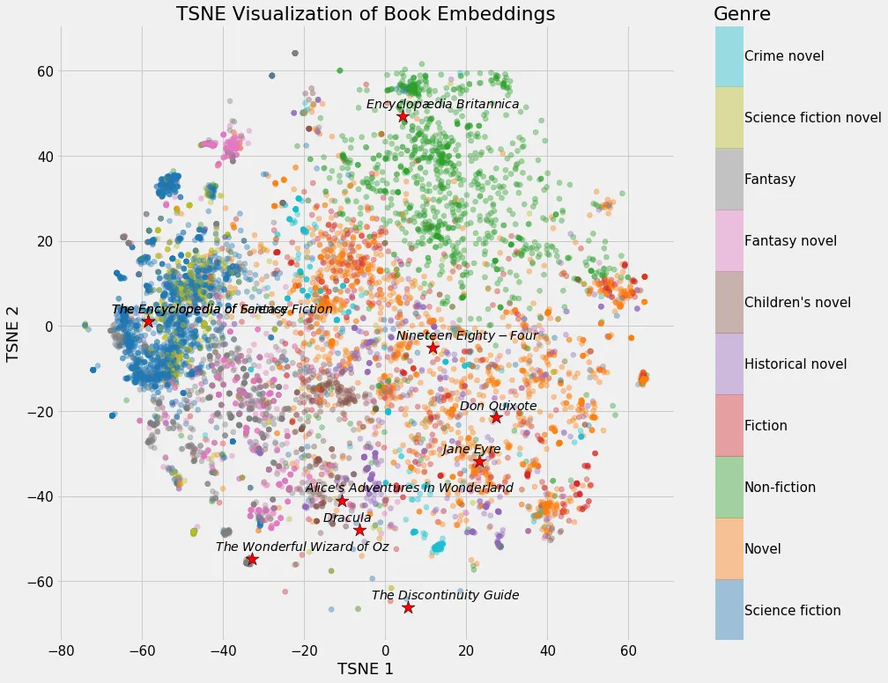

# Week 3

## Embeddings

# First, what is a word?
- We can think of a word as a vector of numbers
- word2vec is a way to turn a word into a vector of numbers

# We can do this with images too!
- img2vec does the same thing as word2vec, basically

# What is a vector?
[0, 1, 2]

- Visualization of vectors here: https://www.math3d.org/vectors
- Further help: https://www.youtube.com/watch?v=ml4NSzCQobk

Vectors are a way to describe data as a point in n-dimensional space (but 2D or 3D is nce for visualization)

- Words can each have a vector
- Sentences can be represented as a vector, too!
- Google image search converts images into vectors!

# So how does that relate to embeddings?
- A vector is an array of numbers, i.e. [0, 4, 2]
- embeddings are a type of vector, i.e. [0, 4, 2]
- the vector is n-dimensional (many more than 3D) and doesn't represent anything obvious, generateed from a language model

vector = embedding -- vector search = similarity search = embedding comparison

# How do we get from a word or sentence to a bunch of vectors?
- We use a language model to generate embeddings
- Specifically we use the "ada-embeddings-002" model from OpenAI
- Google PaLM support for embeddings soon too!

# Embedding concepts

We can embed entire concepts or ideas into a vector

This is what an embedding from ada looks like for "this is a test":
[-0.014042392,-0.008134523,-0.0034623425,-0.022873176,0.004181007,0.017316883,-0.012594723,-0.022114873,0.0010935074,-0.02068099,0.010705859,0.01057488,-0.003670876,-0.01351158,-0.0036088328,0.008100054,0.0438437,-0.007603711,0.012015656,-0.036563993,-0.004408498,-0.0021525465,-0.008644654,0.0026626776,-0.030663015,-0.018240634,0.0031176594,-0.03477164,-0.009078955,0.0017380649,0.026761202,-0.027036948,-0.037005186,-0.027657378,-0.010898882,-0.021522017,-0.011539993,-0.014573204,0.013035918,0.00027014545,0.013146216,0.014145797,0.0048048836,-0.019481493,0.0020577586,-0.0024506974,-0.007500306,-0.018295784,-0.021673677,0.016103597,0.01872319,0.0038673452,-0.013911413,-0.012008762,-0.0027367845,-0.0022473342,-0.010657604,0.008313758,0.0030849145,-0.0105266245,-0.026650904,0.0081138415,-0.019688303,0.019095449,-0.0015864043,-0.012463744,0.008996231,0.017413395,0.009065168,0.012856683,0.02011571,-0.0014967867,-0.002962552,0.011333182,0.036701865,-0.0036501947,-0.012270721,-0.02181155,-0.01114016,0.009926875,0.020212222,-0.008541249,-0.015745128,0.008796315,0.012070805,0.005249525,-0.0026919756,0.014366395,0.0005502005,-0.00466701,0.0034209804,0.012553361,0.0020439713,0.015110911,-0.02527217,0.0037570465,-0.0012934236,0.044147022,-0.021935638,-0.030083947,-0.01322894,-0.011222884,0.01211906,-0.016517218,-0.018337145,-8.945606e-05,-0.004835905,-0.012167316,0.023534967,-0.0028470831,-0.029394582,0.02248713,-0.012601617,-0.031766,0.0059733596,0.0004885884,-0.0043326677,-0.023148922,-0.0034468318,-0.007286602,0.024624167,-0.008141417,0.037887573,-0.0070177494,0.016655091,0.013525368,-0.014945462,-0.024058886,0.006121573,0.013194472,0.011560674,0.01744097,0.023300583,0.0011236671,-0.030414844,0.011602036,-0.030414844,0.018392295,-0.036950037,-0.018585317,-0.0032003834,0.03311716,-0.008410269,-0.012877364,-0.0093891695,0.012498212,0.029973648,0.004780756,-0.0015174677,-0.02769874,0.015883,-0.0061801695,0.013373707,0.0077140094,-0.009361595,0.012898045,0.008065586,-0.0085067805,-0.027574655,0.0014097542,0.0033089584,0.01036807,0.008789421,-0.025010211,-0.004818671,0.017923525,0.010733434,0.008892826,-0.008375801,-0.02022601,-0.01608981,0.021783976,-0.03126966,0.031379957,0.0062008505,0.016269047,-0.010257771,0.013366814,-0.006452469,-0.0067316624,-0.0179511,0.02280424,0.03281384,0.026609542,0.0063766385,-0.018088972,0.0024041652,-0.011788164,-0.0057906774,-0.022211384,0.021894276,0.017661566,-0.0025299746,0.0052770996,-0.70591116,0.0007707978,0.0077277967,-0.0011564121,0.02414161,0.03554373,0.05302606,-0.0043947105,-0.028139934,0.011436588,0.007493412,0.014380182,-0.0036950037,-0.014655929,-0.010044068,0.00017901983,0.010974713,-0.028181296,0.005880295,0.019205747,-0.021315208,0.017041136,0.0024644847,0.0025661662,-0.009030699,0.0007798457,-0.0017354798,-0.008837677,0.006776471,-0.006245659,-0.015924362,0.006555874,0.0075416677,0.0011986358,0.020046774,-0.01106433,-0.016103597,0.014269884,-0.00060707325,0.035764325,-0.020198435,5.2402615e-05,0.03477164,0.024100248,-0.0017871823,0.01260851,0.025189446,-0.006290468,-0.0031504042,-0.010630029,0.0084861,0.0010469751,-0.019219534,0.005001353,0.003174532,-0.006797152,0.0016234578,-0.0009935492,0.0020905035,0.0068247267,-0.019564217,0.003464066,5.910778e-06,-0.011712334,-0.03121451,0.030001223,-0.010464582,0.022859389,0.009361595,-0.006328383,-0.00028457906,-0.0057837837,-0.024334632,-0.008044905,0.019784814,0.028319169,0.016103597,-0.0040396866,-0.008637761,0.0063214893,0.00174065,-0.002486889,-0.009203041,-0.00417756,0.029201558,-0.0063352766,-0.011436588,-0.0031814256,0.018033823,0.003977644,0.023231646,0.015097123,-0.0004493807,-0.010319814,0.015097123,-0.004198241,0.00876874,-0.0043981574,0.029146409,-0.011009181,-0.011602036,0.011726121,0.0036950037,-0.0018509487,-0.004935863,0.003331363,-0.00019226858,0.027781464,0.030552717,0.0019509068,-0.012636085,-0.010643817,-0.009037592,-0.008520568,-0.0017104902,-0.040203847,0.0037880682,0.013870051,0.012911832,-0.026830139,0.018461231,-0.003086638,0.029725477,0.0024231228,-0.012836002,0.006890217,-0.008596399,-0.021067036,-0.009726959,-0.010836839,0.008424057,-0.0025420384,0.01134697,-0.031738427,0.0011021245,2.389893e-05,0.012987662,-0.016682666,0.018130336,-0.017578842,-0.009906194,0.00013442645,0.0037570465,0.015758915,0.010864413,-0.016076023,-0.031379957,-0.0037398124,-0.0048807138,0.020777501,-0.008596399,-0.0038983668,-0.022721514,-0.0034657894,1.0320299e-05,-0.032262344,-0.003605386,-0.0208878,-0.010188835,-0.019536642,-0.0014709354,0.028622491,-0.017468544,-0.000581222,0.001976758,-0.0057837837,-0.019164385,0.024403568,0.0062628933,-0.025258383,-0.0066937474,-0.020570692,-0.005497697,0.032152046,0.002947041,0.012849789,0.004518796,-0.0038776856,0.00639732,-0.015827851,0.005859614,0.010692072,-0.00591821,0.013945881,0.02837432,0.0069522597,0.019219534,0.013325452,-0.0027505718,0.012560255,-0.013111748,0.0011512418,-0.0048703733,0.01537287,-0.001475244,0.0070005152,-0.0041672196,-0.0065489803,0.002416229,0.010878201,0.02820887,-0.009533937,-0.0019164385,-0.00856193,0.022266533,-0.031986598,0.0052598654,-0.027298907,0.010113005,0.01733067,0.010623136,-0.038769964,-0.03151783,-0.002859147,0.025630642,0.027519505,-0.0077829463,0.0024886124,-0.0029108494,0.0011900186,0.007479625,-0.010057855,0.014407757,-0.016007086,-0.0077553713,0.003919048,0.012463744,0.03874239,0.022349257,-0.02594775,-0.019274684,0.014035499,-7.0229195e-05,-0.0018836935,0.021411719,0.019426344,0.0058079115,-0.02150823,0.04833837,0.02263879,0.020363882,0.0053150146,0.025644429,-0.0069522597,0.028029636,-2.8059365e-05,0.031959023,0.00015855426,-0.0048221177,0.0068247267,-0.0039293882,0.008403376,-0.009058273,-0.019412557,0.03038727,-0.018916212,0.011126373,0.0104094315,0.017041136,0.04400915,0.0041465387,0.0091134235,0.0037846214,0.00027919337,0.008527461,-0.009506362,0.009871726,-0.007458944,-0.0028195083,-0.030525142,-0.005652804,-0.0058906353,0.012353445,-0.016310409,0.0117054405,0.024362206,0.012422382,0.00022490577,0.013380601,-0.012767064,-0.0084861,-0.014393969,0.016131172,-0.0008461972,0.005184035,-0.024748253,-0.029835775,-0.014490481,-0.005325355,0.007007409,-0.0007798457,-0.012553361,0.012436169,-0.018792126,0.012291402,0.012808427,0.017082497,-7.868471e-05,-0.0030487226,-0.007776052,0.014145797,-0.0039673033,-0.0060388492,-0.02476204,0.007824308,0.00067342474,-0.018957574,-0.03104906,0.015262571,0.00075657957,0.019522855,0.011078117,-0.011381438,-0.0017147989,0.0072176657,0.008348227,-0.0071969847,-0.0028332956,0.02408646,0.0137252845,-0.03162813,-0.014766227,-0.015814064,-0.0018630126,0.07224559,0.021880489,0.012112167,0.023410881,-0.0038845793,-0.011167735,-0.021342782,-0.012146635,0.009851045,-0.0066696196,0.0004903118,-0.007252134,0.005387398,-0.0092719775,0.003994878,0.02986335,-0.0014821377,-0.008892826,0.01418716,0.01384937,-0.014711078,-0.0019164385,0.025023999,0.01072654,0.023341944,-0.0012296572,0.0016803305,0.018061398,-0.0007626115,-0.01603466,-0.011636504,0.019991625,-0.0038845793,0.017606417,-0.0035984924,0.02645788,8.0838974e-05,0.015428019,0.0125878295,-0.013160003,0.019964049,0.003286554,-0.001342541,-0.0019405662,0.0019285023,-0.011526206,0.013215153,0.0072797085,-0.008093161,-0.017633991,0.018295784,0.019371195,-0.016007086,-0.01287047,0.0067109815,0.029394582,-0.0024679315,-0.0056631444,-0.011863995,-0.014407757,-0.021535804,-0.035267983,0.003667429,-0.0104439,-0.01405618,-0.024210546,-0.016724028,-0.01204323,-0.03697761,-0.018681828,-0.008086267,-0.02011571,-0.007231453,-0.010616242,0.015386657,-0.011960506,0.017551268,0.0045636054,0.0033210225,0.017372033,-0.015000612,-0.004346455,-0.009630448,-0.016834326,0.008168992,0.015717553,0.0034123634,-0.003000467,0.008465419,-0.0031865959,0.008403376,-0.0011314225,-0.0003354198,-0.03121451,0.0055459524,0.003086638,-0.007982862,0.019509068,-0.012201784,-0.007190091,-0.00058251456,-0.022266533,0.00487382,-0.0018457784,0.0059768064,0.011733015,-0.025920175,0.027036948,-0.011539993,-0.008954869,0.029587604,-0.015110911,0.007893245,-0.0051702475,0.01016126,0.00086170796,-0.0069350256,0.031959023,-0.010437006,-0.013484006,-0.0046635633,-0.028512193,0.031903874,0.011643398,-0.0044360724,-0.005697613,-0.001195189,-0.006904004,-0.0030228714,0.010106111,-0.011691653,0.01970209,-0.012222465,-0.015483168,-0.0398178,-0.031683277,-0.0199089,0.026816351,0.0049841185,0.0057286345,-0.019302258,0.0133323455,0.017509906,-0.03270354,0.0014588715,-0.03719821,-0.01655858,0.012208678,-0.01608981,0.019288471,0.00522195,-0.007969075,-0.030828463,-0.008720485,-0.015896788,-0.038411494,0.0048221177,-0.007969075,0.026499243,0.02280424,0.022625003,-0.010898882,0.012443063,0.006311149,0.011994975,-0.0037777277,-0.020708565,0.009802789,-0.0031055955,0.013856264,0.015248784,-0.009864832,0.0051530134,0.006414554,0.011712334,0.023493605,-0.00092805945,0.00080181926,-0.0044533066,-0.011029862,-0.008038011,-0.0027815932,-0.0030573397,0.020005412,-0.0060974453,-0.008582611,0.020598266,0.005687272,0.0009694214,0.0008759261,0.011250459,-0.020308733,-0.009982024,-0.001935396,0.004467094,0.001481276,-0.016158747,-0.040148698,-0.00042913057,0.02068099,0.004573946,0.014380182,-0.008341333,0.015469381,-0.018557742,0.027519505,-0.026678478,-0.01253268,-0.004277518,-0.019274684,-0.0017639161,0.003095255,0.020515542,-0.014063073,0.008534355,0.011905357,-0.016572367,0.0027436782,-0.008465419,-0.013621879,-0.011195309,-0.00041922092,0.026664691,0.031959023,0.020391457,0.027588442,0.003588152,-0.022376832,-0.0070384303,-0.009458106,-0.0064111073,0.033668652,0.022018362,-0.00417756,-0.007134942,0.0149041,0.021080824,-0.0050082467,-0.011257352,0.0068488545,0.016572367,-0.008720485,-0.021260059,-0.0072245593,-0.047593854,0.019509068,-0.0013899349,-0.018778339,-0.009857939,-0.001274466,0.001183125,0.021880489,-0.017413395,0.012394807,0.021839127,-0.017054923,0.0021973553,-0.007438263,-0.022087298,0.0014442225,-0.0031021487,0.037473954,-0.018681828,-0.0031521276,0.020818863,-0.0029487645,-0.015386657,-0.010299133,-0.010340495,0.028153721,-0.019688303,0.003991431,-0.008403376,0.02062584,0.013594304,0.0057493155,-0.015717553,-0.016999774,-0.009506362,-0.0035984924,0.014228522,0.015055761,-0.0047221594,-0.009837258,-0.009837258,-0.0011029862,-0.011257352,-0.03661914,0.005039268,-0.010561093,-0.025506554,0.0046566697,-0.0056045484,-0.00069410575,0.016985986,-0.01712386,0.0042085815,0.013015237,-0.034551043,0.0019405662,-0.011884676,-0.00430854,-0.013318558,0.022390619,-0.013539155,-0.019371195,0.0036398543,-0.026444092,-0.016737815,-0.024775827,-0.010099217,0.013146216,0.0017854589,-0.018626679,0.011395226,-0.005163354,0.0044774343,0.00086558564,-0.018557742,0.013752859,-0.014600779,0.007603711,0.0046807975,-0.018612891,0.003248639,0.00042266774,0.015648616,0.0020939503,-0.023810714,-0.014200947,0.0022973134,0.0086239735,-0.015510743,-0.013766646,-0.018792126,0.0046945848,0.0040465803,0.021770189,0.0002697146,-0.0050875237,-0.011870889,-0.01759263,0.008472312,0.02414161,-0.01328409,0.0027488484,-0.028484618,-0.010547305,-0.026802564,-0.0034037463,-0.0047428403,0.02903611,0.019150598,-0.009058273,-0.019977838,-0.004346455,-0.053356957,-0.01189157,0.0036295138,0.018433657,0.02956003,0.0061801695,-0.022942113,0.025244595,0.017179009,0.014531842,-0.018750764,-0.016655091,0.021342782,-0.011919145,0.012863576,-0.0062939147,-0.03537828,-0.0053805043,0.016310409,0.013704603,0.016779177,-0.007679541,-0.0052598654,-0.009127211,-0.010209516,0.006414554,-0.0015562446,-0.021315208,-0.002130142,-0.014063073,-0.0061836164,0.009292658,-0.00716941,-0.012505106,-0.018116547,-0.0043740296,-0.00570106,0.016158747,-0.04389885,-0.008713591,-0.004711819,-0.028153721,0.014393969,0.0047221594,0.007665754,0.029449731,-0.001773395,-0.0066868537,-0.014242309,0.004256837,-0.030442419,-0.0018199271,-0.0024127823,-0.015290146,-0.015869213,-0.018612891,-0.00090910186,-0.014042392,0.008713591,-0.010588667,-0.009347808,0.010947138,0.01810276,0.018185485,-0.021466868,0.00045799778,-0.015124698,-0.0036812164,0.0037122378,-0.015745128,0.008237928,-0.0083689075,0.013215153,0.012050124,-0.008320652,-0.012711915,-0.028457044,0.01335992,-0.013546049,0.0066903005,0.20636871,-0.0034899171,-0.0075209867,0.027960699,0.004367136,0.011353863,0.011436588,0.005001353,0.005163354,0.025341107,0.038411494,-0.0057872306,0.0022387172,0.010740328,0.0046428824,0.01712386,-0.012787746,-0.023810714,-0.00037484296,-0.020929163,0.0055873143,-0.016462069,0.002100844,-0.0021887382,0.044091873,0.0056596976,-0.0038776856,0.009968237,0.02645788,-0.0042464966,-0.035709176,-0.0088790385,0.010698966,-0.0104094315,-0.021480655,-0.009892407,-0.0019612473,0.026030473,0.025768515,-0.013001449,0.003514045,-0.0021266951,0.015951937,-0.016544793,-0.017523693,0.018971361,0.008306865,-0.013263409,0.0041258577,0.009416744,-0.035267983,-0.006104339,0.00047264682,0.0125878295,0.0092719775,-0.0056838254,0.038466644,-0.015262571,0.0012408594,0.0034020229,-0.03069059,0.008086267,-0.02956003,0.031903874,-0.026885288,0.016668878,-0.011002287,0.012642979,0.01031292,0.0020629289,0.008513674,-0.018447444,0.0025385916,-0.014766227,-0.02837432,-0.007907032,0.027050735,0.02423812,0.030028798,0.005252972,-0.0055011436,-0.0074313693,0.0015054038,-0.015110911,-0.0125878295,-0.03193145,0.002950488,0.0045808395,-0.00820346,0.0042844117,-0.026733628,-0.0081138415,-0.018861063,-0.02512051,0.014035499,0.0417756,0.0005876848,0.026678478,-0.0022783559,0.00016652506,-0.0146283535,0.014614566,0.025258383,0.012594723,0.0026540605,0.020570692,-0.010616242,0.005228844,-0.0042913053,-0.015676191,-0.009023805,-0.027795251,0.012236252,-0.013752859,0.011733015,-0.0012365509,0.0029332538,-0.013580517,0.0032348516,-0.0059595723,0.006841961,0.0041741133,0.0038087491,0.0033589376,-0.010954032,-0.0015338401,-0.016586155,0.002448974,0.023686627,-0.018640466,0.01114016,-0.0052047158,0.010437006,-0.005611442,-0.011298714,-0.017110072,0.002419676,0.0018957575,-0.03513011,0.0033554907,0.019384982,-0.019688303,-0.014325033,0.0096442355,-0.0013589134,-0.011126373,0.022831814,0.006597236,-0.008637761,-0.0033382566,-0.008079373,-0.015000612,-0.0044119447,0.0034158102,0.026430305,-0.0113125015,-0.0169722,-0.025368681,0.01072654,-0.004105177,-0.038356345,-0.005759656,0.046711463,-0.006004381,-0.020639628,0.0025937408,-0.18265451,0.019964049,0.019977838,0.001029741,0.006904004,0.007872564,0.025354894,-0.005197822,-0.0062973616,0.011767483,0.016420707,0.0043188804,-0.023190284,-0.006497278,0.0063594044,0.0057148472,-0.011202203,-0.006576555,0.024031311,0.016062235,0.013242728,-0.014083754,0.007114261,-0.02243198,-0.0031728086,0.0022352703,0.0024644847,0.016048448,0.008044905,-0.0067488966,-0.01552453,-0.003086638,0.014821377,-0.0030383822,0.0059733596,-0.005477016,0.0104301125,-0.021522017,-0.0106644975,0.0068523013,0.005590761,0.028622491,-0.0074106883,-0.017565055,-0.005349483,0.0053184615,0.018254422,-0.00024881816,0.026182134,-0.026030473,0.009995813,-0.023079986,0.0037018973,-0.022556067,0.022942113,0.003310682,-0.022045936,0.00073331344,0.019329833,0.0042499434,-0.005118545,-0.0338341,0.01821306,-0.0048669265,-0.024527654,-0.022859389,-0.013449538,0.011333182,-0.020060562,-0.0014054456,0.002929807,-0.014256096,0.028870663,-0.015869213,0.023024837,-0.0006592066,-0.021646103,0.0071004736,-0.0052943337,-0.0054149725,-0.007307283,0.041444704,0.007307283,0.010850626,0.0069522597,0.012187997,0.0024886124,0.015869213,-0.013966562,-0.011815739,0.030525142,0.008410269,-0.008472312,-0.0151384855,0.009706278,0.015827851,-0.00542876,0.008396482,0.007134942,-0.004098283,0.004649776,0.0038673452,-0.022142448,0.017565055,0.02301105,0.0051323324,0.005246078,0.038576942,0.027560867,0.0015795106,-0.03206932,-0.007879457,0.017633991,0.016544793,0.017868375,0.035957348,0.015193635,-0.030552717,-0.0026488903,-0.009658023,0.039376605,-0.010540412,-0.020501755,0.016944624,-0.0015915745,-0.0053736106,-0.08934188,-0.053108785,0.012994556,0.042630415,-0.010140579,0.0337238,0.0075416677,0.019109236,-0.014848951,0.035626452,-0.031655703,-0.009568405,-0.015841639,-0.015386657,-0.0012641256,0.015193635,-0.0022059723,0.0010624859,-0.005670038,0.03832877,-0.016944624,-0.0065627676,-0.0008177608,-0.028139934,-0.011367651,0.0011038479,-0.032841414,0.020901587,0.014504268,-0.0029349772,-0.0018130335,-0.016792964,0.014366395,-0.043044034,-0.0060767643,-0.011395226,-0.024955062,-0.020184647,0.043237057,-0.011670972,0.014945462,0.009196147,0.012773958,-0.022294108,0.017647779,-0.016682666,0.0026919756,0.011953613,-0.008968656,-0.021963213,-0.008982443,0.00417756,0.00542876,0.00047523194,0.00079320214,-0.0006204297,0.023824502,0.019991625,-0.008899719,-0.0005114237,-0.005018587,0.00023438456,0.003791515,0.010416325,-0.015510743,0.0033348098,-0.027505718,-0.020763714,0.015469381,-0.011078117,0.005404632,0.0019181619,-0.012629191,0.019371195,-0.025175659,0.023852076,-0.02677499,-0.016200108,0.023328157,-0.017675353,-0.00508063,-0.007272815,0.011615823,-0.02423812,0.034495894,-0.0040913895,-0.020446606,-0.0058699544,0.004467094,-0.02671984,-0.0020491416,0.025106722,0.020446606,-0.011726121,-0.030359695,0.010719647,-0.003012531,-0.012953194,0.012815321,0.0070005152,-0.019688303,-0.029394582,-0.05807222,0.012001868,0.006910898,-0.010774796,0.0035709178,0.0136080915,0.007989756,-0.020157073,1.86479e-05,0.014104435,-0.019936474,0.011898464,-0.00028867216,-0.013932094,-0.015745128,-0.012891151,0.016599942,0.018392295,0.018144123,0.021646103,0.010561093,-0.014449119,0.017702928,0.00048427985,-0.0039638565,0.01650343,-0.012387914,0.00011589972,-0.0017621927,-0.016544793,0.0015226379,-0.0119674,-0.0042258156,0.008892826,-0.021439293,-0.00536327,-0.015745128,0.007252134,0.015041973,-0.0010125068,-0.012601617,-0.025492767,0.0072383466,-0.037970297,-0.017013561,0.0092719775,-0.021687465,0.015359082,0.016158747,-0.00028845674,0.014518055,0.009520149,-0.016820539,-0.014531842,-0.013118641,-0.023286795,0.0015752021,0.0029935734,0.009147892,-0.017013561,0.035212833,0.010623136,0.03488194,0.012360339,0.015841639,0.0020818864,-0.015758915,0.0053391424,0.016792964,-0.023755565,-0.010995394,-0.016944624,0.02450008,-0.0038018555,0.014862739,-0.0010685178,-0.013373707,-0.0019715878,0.013552942,0.024362206,0.0002610975,0.013277196,-0.0460221,0.021535804,0.020777501,0.021687465,-0.009423638,0.0052426313,-0.0042706244,-0.0056183357,-0.025437618,0.009726959,-0.010754115,0.0014330203,-0.00410173,0.016599942,0.014476693,0.0006221531,0.024031311,0.016117385,0.011257352,0.0021439292,0.0036846632,-0.01147795,0.009313339,-0.006841961,-0.03270354,-0.031104209,-0.0023197178,0.021039462,0.019812388,0.0045842864,0.005614889,0.008699804,-0.0091134235,0.014724866,-0.016158747,0.004163773,-0.01934362,0.012836002,-0.013070386,0.015152273,0.034275293,-0.002552379,0.013580517,-0.0022352703,0.020901587,-0.0066075763,-0.0006139669,0.015069548,0.011181522,-0.012263827,-0.021494443,-0.023976162,-0.014890313,-0.011395226,-0.0048703733,0.0064834906,-0.027312694,0.04792475,0.02496885,-0.017110072,0.004122411,0.0077691586,0.008024224,0.008803208,0.023576329,-0.008713591,-0.012325871,0.020074349,0.00417756,0.0070728986,-0.012139741,-0.026968012,0.010698966,0.0014717971,0.010464582,0.0017432352,-0.00062430743,0.005197822,-0.004408498,0.023300583,0.013552942,-0.013518474,-0.01578649,0.027519505,-0.00026368262,-0.016007086,-0.016599942,0.018902425,-0.005159907,-0.03157298,-0.016682666,0.016779177,-0.0097614275,-0.0011245288,-0.013166897,0.006814386,0.004615308,0.026706053,0.03408227,-0.040727764,-0.030828463,0.0045670522,0.006214638,-0.015745128,-0.0129600875,0.0068626422]

- WTF? For 5 words?
- Yeah. The ada model has a fixed dimension of 1536 numbers. Different models have different numbers
- NOTE: a paragraph and a single word have the same dimensions, so in the future we will break up documents into paragraphs and then into sentences to capture the concept details in high resolution

# Further Reading
https://www.youtube.com/watch?v=JmT3-ev2_ds
https://developers.google.com/machine-learning/crash-course/embeddings/video-lecture

# Vector Search
- We can use a vector database to store memories and recall them based on similarity
- Similarity is computed by comparing the distance of the vectors from each other

## knn vs ann
- knn is the most popular, but it's slow, however it works with postgres (standard database)
- ann is faster, but it's more complicated to integrate, requires a specialized database

- the most popular and best implementation of ANN is HNSW
"Hierarchical Navigable Small World Graphs" - https://arxiv.org/abs/1603.09320
- HNSW is used by Weaviate, Qdrant, Chroma, Pinecone, Haystack, Milvus, and FAISS

- In Magick we currently use a knn with pgvector, but we're integrating many vector stores through langchain.js

- Also support Pinecone, but only reading for now

## What can we use this for?
- Classification -- does this idea fit within one of our categories?
- Retrieval -- what is the most similar idea to this one?
- Moderation -- is this idea similar to any of our banned ideas?

and of course...
### Long term memory
- We can store memories in a vector database and recall them based on conceptual similarity

## To Magick!

- Review events and short term memory
- Introduce create embedding node and demonstrate output
- Implement embeddings in graph
- Introduce exlusive gate node
- Find Cached Embedding node, save cost and money!